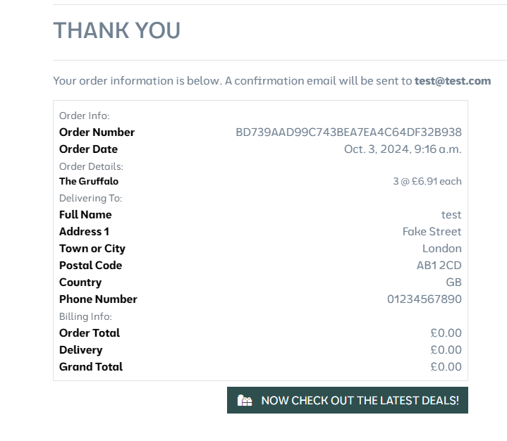
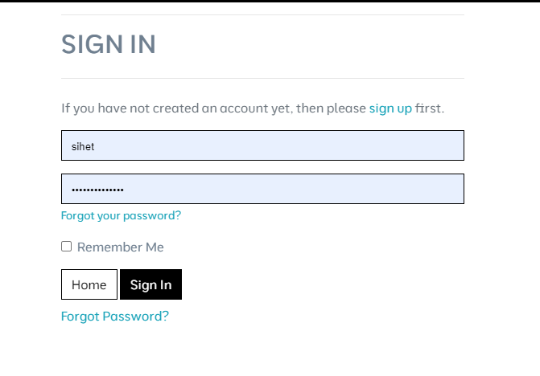
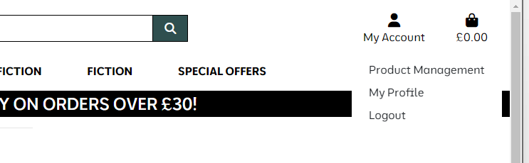
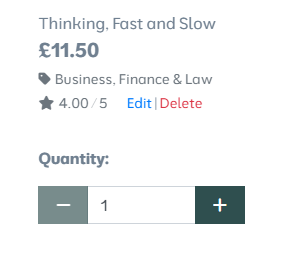
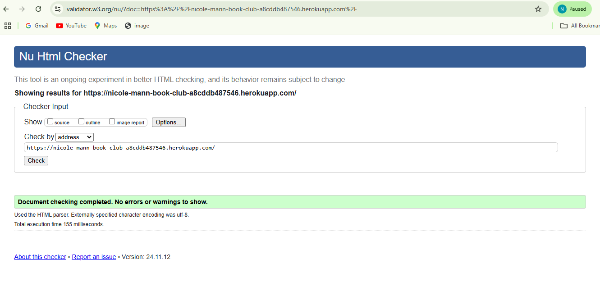

# Coder's Cafe 
This is a fullstack project written in Python using the Django framework on the backend, connecting to a PostgreSQL database. Using the bootstrap framework on the frontend within HTML and CSS

## Important notes 
The admin superuser is as follows, username: `admin123` & password is: `a3e5n7`.

In order to test the functions of the checkout page and all its features, new users can be created in the account page.

There is an issue with a large number of images, see the Bugs section of this readme for more information.

## Testing

See below for a brief synposis of my testing flow, for a more in-depth look, visit https://github.com/users/Nicolemann98/projects/2 and check the comments on each ticket in the Done column, here it is broken down by feature rather than the overall look below.

Initally I tested to ensure that the homepage would be responsive over desktop, tablet and mobile screens
Responsive home screen on mobile:

Homepage:


Responsive homescreen on tablet: 


And on a phone:


This responsiveness is also true for other pages including the products, basket, and checkout. Noting that stripe is successfully integrated into this test environment to take card payments and give us a success or error message.


And on success, we get a notification, order details and a success email gets sent to our email address.



This is the booking screen from the staff member's perspective:

They are also able to create an account and log in and out of it.



Logging in as a superuser (admin123, see above) we are easily able to add new products under My Acount -> Product Management



They are also able to edit and delete products by navigating to the product page (or even from the all products page)



Navigating these successfully works at creating/editing/deleting the chosen product.

## Bugs 

There was an issue with very slow loading speeds for the products, this is due to the large number of available products on this site. I tackled this by using Django pagination to separate the products onto pages.

Webhooks were receiving a 401 error, the cause was that the link was not public, so I made the URL public to resolve this.

There is an ongoing issue with not all of the images showing correctly. This is because the data set I chose is very large and I hit the upload data limit for the free AWS plan, if this was a real application then I would simply pay the AWS cost from the company expense account and allow the upload to finish, however because this is for educational purposes and I am not running a real company, I decided to stop the upload just as the free amount ran out and save myself the cost. Even though a lot of them are missing, the examiner will be able to see that a lot of them are present which proves that I have the knowledge of how to do this, just not the money, as a side-note, the upload seemed to run in reverse alphabetical order by categories so to see the desired images, filter by categories later in the alphabet.

## Validators

The code passes the W3 HTML validator at https://validator.w3.org/



The code passes the inbuild python flake validator. The only errors are auto-generated classes, a single one in urls.py about the 404 handler, and a single one about 'checkout.signals' being imported but unused. However all auto-generated code is okay to ignore as sometimes they intentially ignore formatting for performance purposes and the other two and the standard implementations set out by code institute's documentation.

```
gitpod /workspace/book-club (main) $ python3 -m flake8
./.vscode/arctictern.py:10:1: F401 'subprocess' imported but unused
./.vscode/arctictern.py:20:80: E501 line too long (92 > 79 characters)
./.vscode/arctictern.py:48:22: E124 closing bracket does not match visual indentation
./.vscode/arctictern.py:51:22: E124 closing bracket does not match visual indentation
./.vscode/arctictern.py:64:1: W293 blank line contains whitespace
./.vscode/arctictern.py:71:1: E302 expected 2 blank lines, found 1
./.vscode/arctictern.py:79:1: W293 blank line contains whitespace
./.vscode/arctictern.py:100:10: E231 missing whitespace after ','
./.vscode/arctictern.py:109:1: W293 blank line contains whitespace
./.vscode/arctictern.py:110:80: E501 line too long (81 > 79 characters)
./.vscode/arctictern.py:136:1: W293 blank line contains whitespace
./.vscode/arctictern.py:154:19: E712 comparison to True should be 'if cond is True:' or 'if cond:'
./.vscode/arctictern.py:156:1: W293 blank line contains whitespace
./.vscode/arctictern.py:169:80: E501 line too long (98 > 79 characters)
./.vscode/arctictern.py:178:80: E501 line too long (92 > 79 characters)
./.vscode/make_url.py:10:39: E231 missing whitespace after ','
./.vscode/make_url.py:11:36: E231 missing whitespace after ','
./.vscode/make_url.py:12:39: E231 missing whitespace after ','
./book_club/urls.py:20:1: F811 redefinition of unused 'handler404' from line 6
./checkout/apps.py:9:9: F401 'checkout.signals' imported but unused
./checkout/migrations/0001_initial.py:19:80: E501 line too long (117 > 79 characters)
./checkout/migrations/0001_initial.py:20:80: E501 line too long (82 > 79 characters)
./checkout/migrations/0001_initial.py:25:80: E501 line too long (85 > 79 characters)
./checkout/migrations/0001_initial.py:28:80: E501 line too long (92 > 79 characters)
./checkout/migrations/0001_initial.py:29:80: E501 line too long (83 > 79 characters)
./checkout/migrations/0001_initial.py:31:80: E501 line too long (98 > 79 characters)
./checkout/migrations/0001_initial.py:32:80: E501 line too long (97 > 79 characters)
./checkout/migrations/0001_initial.py:33:80: E501 line too long (97 > 79 characters)
./checkout/migrations/0001_initial.py:39:80: E501 line too long (117 > 79 characters)
./checkout/migrations/0001_initial.py:41:80: E501 line too long (104 > 79 characters)
./checkout/migrations/0001_initial.py:42:80: E501 line too long (137 > 79 characters)
./checkout/migrations/0001_initial.py:43:80: E501 line too long (115 > 79 characters)
./checkout/migrations/0004_order_user_profile.py:18:80: E501 line too long (155 > 79 characters)
./newsletter/migrations/0001_initial.py:17:80: E501 line too long (117 > 79 characters)
./newsletter/migrations/0002_newsletter_remove_newslettersubscription_is_active_and_more.py:17:80: E501 line too long (117 > 79 characters)
./newsletter/migrations/0002_newsletter_remove_newslettersubscription_is_active_and_more.py:28:80: E501 line too long (117 > 79 characters)
./newsletter/migrations/0002_newsletter_remove_newslettersubscription_is_active_and_more.py:29:80: E501 line too long (123 > 79 characters)
./newsletter/migrations/0002_newsletter_remove_newslettersubscription_is_active_and_more.py:30:80: E501 line too long (148 > 79 characters)
./newsletter/migrations/0003_newsletter_body_newsletter_subject.py:9:80: E501 line too long (91 > 79 characters)
./products/migrations/0001_initial.py:18:80: E501 line too long (117 > 79 characters)
./products/migrations/0001_initial.py:20:80: E501 line too long (91 > 79 characters)
./products/migrations/0001_initial.py:26:80: E501 line too long (117 > 79 characters)
./products/migrations/0001_initial.py:27:80: E501 line too long (82 > 79 characters)
./products/migrations/0001_initial.py:31:80: E501 line too long (103 > 79 characters)
./products/migrations/0001_initial.py:32:80: E501 line too long (83 > 79 characters)
./products/migrations/0001_initial.py:33:80: E501 line too long (86 > 79 characters)
./products/migrations/0001_initial.py:34:80: E501 line too long (141 > 79 characters)
./products/migrations/0002_product_currency_product_format_product_old_price.py:26:80: E501 line too long (81 > 79 characters)
./products/migrations/0005_product_creation_date.py:17:80: E501 line too long (98 > 79 characters)
./profiles/migrations/0001_initial.py:21:80: E501 line too long (117 > 79 characters)
./profiles/migrations/0001_initial.py:22:80: E501 line too long (97 > 79 characters)
./profiles/migrations/0001_initial.py:23:80: E501 line too long (111 > 79 characters)
./profiles/migrations/0001_initial.py:24:80: E501 line too long (93 > 79 characters)
./profiles/migrations/0001_initial.py:25:80: E501 line too long (97 > 79 characters)
./profiles/migrations/0001_initial.py:26:80: E501 line too long (100 > 79 characters)
./profiles/migrations/0001_initial.py:27:80: E501 line too long (100 > 79 characters)
./profiles/migrations/0001_initial.py:28:80: E501 line too long (91 > 79 characters)
./profiles/migrations/0001_initial.py:29:80: E501 line too long (121 > 79 characters)
gitpod /workspace/book-club (main) $
```

## Deployment 

This project was deployed onto Heroku, the link for which is: https://nicole-mann-book-club-a8cddb487546.herokuapp.com/. I have followed the heroku documentation to set up auto deployments whenever code is pushed to the main branch, so to deploy changes to this application, simply commit and push that change to the main branch of this repository.

## Credits 

- Code institute course materials
- Django documentation: https://docs.djangoproject.com/en/5.0/
- Font Awesome for icons
- Favicon created from https://favicon.io/favicon-converter/
- Image on main site page from Pexels

## Struggles

This was a very challenging project, as it combined a range of new techniques that were unfamiliar to me, I made a number of minor errors throughout that impacted the output and produced error messages


