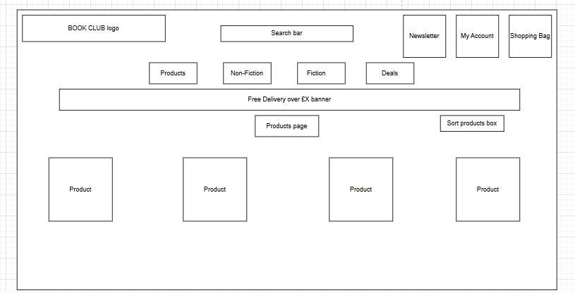
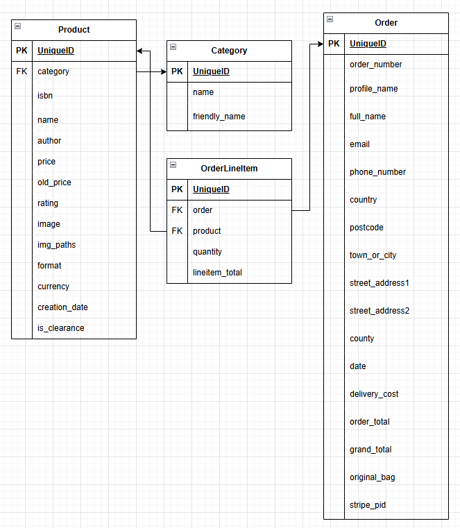
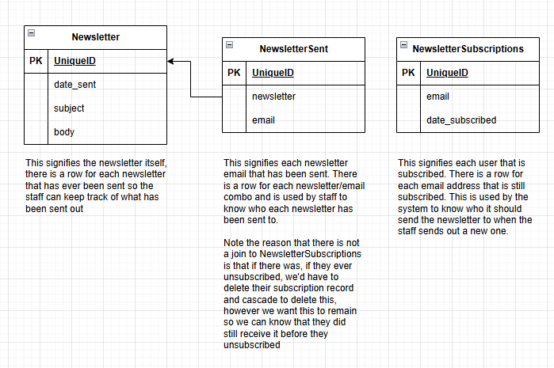
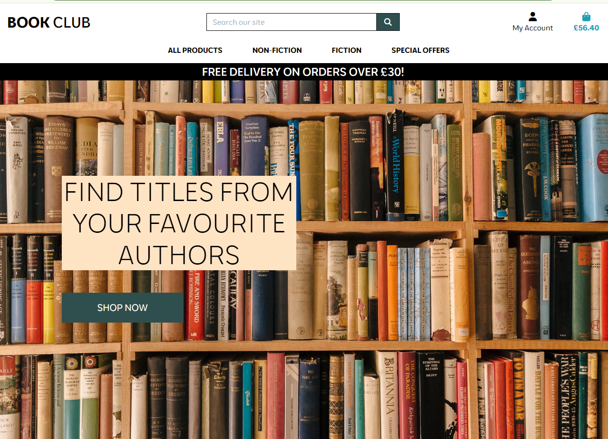
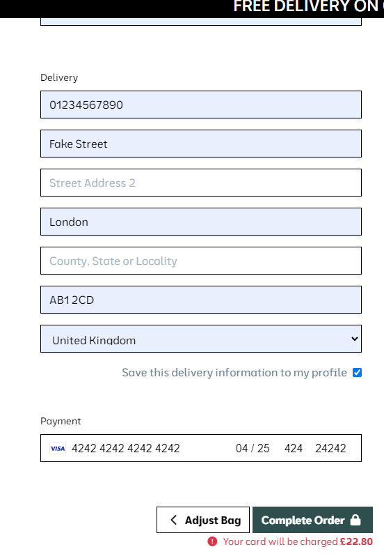
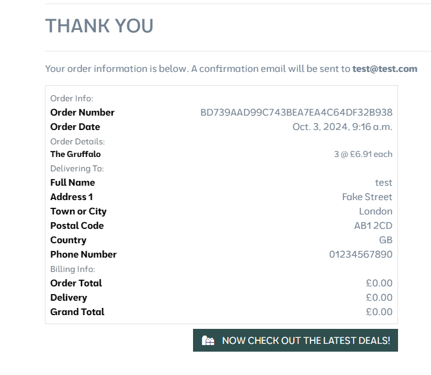
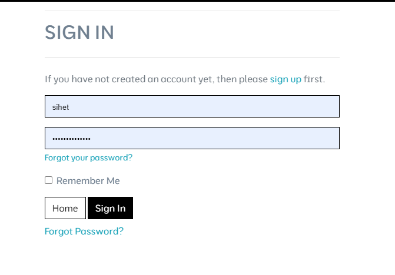
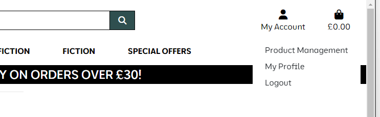
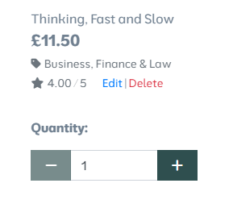
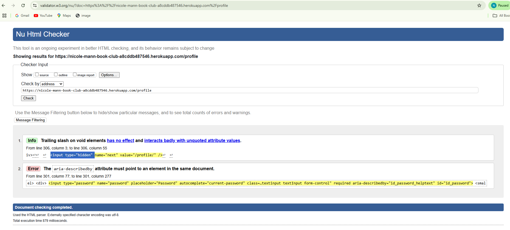

# Coder's Cafe 
This is a fullstack project written in Python using the Django framework on the backend, connecting to a PostgreSQL database. Using the bootstrap framework on the frontend within HTML and CSS.

The aim of this project was to create a mockup for an E-Commerce B2C platform whereby customers can buy books at a competitive price. As a B2C application it allows the consumers to purchase the products directly from the business.

The aim when it comes to creating B2C applications is to make the process as user friendly as possible to enhance the shopping experience and make sales quickly. On the business' side of things, it must be easy to keep track of stock levels, which books are best-sellers and which books are not selling well, to tailor the site to what customers want and what will make the most money. Having a manageable database system will make stock keeping a much more simple experience, and allow the business to create new deals to try to entice customers to buy more products. It is essential that the site is quick and easy to navigate with features that speed up the transaction process for consumers (e.g being able to save card and address details for future purchases).

The basic wireframe I made for the design and layout of the homepage is as follows: 



## Important notes 
The admin superuser is as follows, username: `admin123` & password is: `a3e5n7`.

In order to test the functions of the checkout page and all its features, new users can be created in the account page.

## Database Model

Excluding the default "profiles" model. There are 2 separate entity relation diagrams for this application which have no links beteween the two of them, one for products and checkouts



And the other is for the newsletter.



Note that in a future iteration of this application, I would improve the newsletter functionality, at present it is a fairly simple process email that is sent out by an admin user that only has a subject and a text body. I could allow for HTML inputs (potentially with a default design) to allow for a more customised and good looking email, along with the ability to add images or links or coupons for certain books. However for now it is still a good way for the staff to keep in touch with customers, tell them about the latest books and any news updates regarding the store.

## Security features

A significant number of the views added have some form of validation to ensure that they can only be called by the required users, so even if a bad actor knows the correct URL for certain actions, they will be met with an error and redirected to another page. Some examples of this are:
- When adding, editing, or deleting a product, before anything else the views will check if the current user is a superuser, if they are not, then they are redirected back home.
- When sending out a newsletter to all users, the same superuser check is done
- When viewing all newsletters, if the user is a superuser, then the data is enriched with the email addresses of each person sent that newsletter, if they are not a superuser, then they can only see the newsletters themselves

Aside from just user checks, each form has a check on the data to to ensure that it is in a valid state. Notable inclusions are
- Type checks, e.g. numbers fields do not accept letters
- Dates are valid
- Email addresses are valid
- When subscribing to a newsletter, the provided email address cannot already be subscribed, and conversely when unsubscribing, that email address does need to already be subscribed
- On checkout, the stripe payment must succeed before order records are created and success email is sent
- Checkout cannot be called on an empty bag 

## Testing

See below for a brief synposis of my testing flow, for a more in-depth look, visit https://github.com/users/Nicolemann98/projects/2 and check the comments on each ticket in the Done column, here it is broken down by feature rather than the overall look below. This also shows the desired User Stories for this project.

Initally I tested to ensure that the homepage would be responsive over desktop, tablet and mobile screens
Responsive home screen on mobile:

Homepage:



Responsive homescreen on tablet: 


And on a phone:


This responsiveness is also true for other pages including the products, basket, and checkout. Noting that stripe is successfully integrated into this test environment to take card payments and give us a success or error message.



And on success, we get a notification, order details and a success email gets sent to our email address.



This is the booking screen from the staff member's perspective:

They are also able to create an account and log in and out of it.



Logging in as a superuser (admin123, see above) we are easily able to add new products under My Acount -> Product Management



They are also able to edit and delete products by navigating to the product page (or even from the all products page)



Navigating these successfully works at creating/editing/deleting the chosen product.

## Bugs 

There was an issue with very slow loading speeds for the products, this is due to the large number of available products on this site. I tackled this by using Django pagination to separate the products onto pages.

Webhooks were receiving a 401 error, the cause was that the link was not public, so I made the URL public to resolve this.

There was an ongoing issue with not all of the images showing correctly. This was because the data set I chose is very large and I hit the upload data limit for the free AWS plan, if this was a real application then I would simply pay the AWS cost from the company expense account and allow the upload to finish, as a side-note, the upload seemed to run in reverse alphabetical order by categories so to see the desired images, filter by categories later in the alphabet.

There was a bug whereby user registration returned a 500 server error, this used to work, however as part of the flake validation tool I had to shorten certain lines. This includes the AUTH_PASSWORD_VALIDATORS in settings.py file, however I used `\` to concatinate different lines. This does not actually work within strings. I did not thoroughly test the application again after changes to make the validations pass as I assumed I made no funcitonal changes to the code. I have now fixed this now and i'm using `+` to concatinate the strings on separate lines.

There was also a bug where on checkout, orders are duplicated and stored with 0.00 price values. This was caused by a misunderstanding on how to use Django signals. After reading the documentation again, I found I was missing 2 lines in the CheckoutConfig class which imported the signals I created. This has now been added again.

## Validators

### W3 Validator

The code passes the W3 HTML validator at https://validator.w3.org/


This is true for all pages with the exception of the profile page (see below), however that is from Django's code and is not within my codebase so I will ignore this



### Flake Validator

The code passes the inbuild python flake validator. The only errors are auto-generated classes, a single one in urls.py about the 404 handler, and a single one about 'checkout.signals' being imported but unused. However all auto-generated code is okay to ignore as sometimes they intentially ignore formatting for performance purposes and the other two and the standard implementations set out by code institute's documentation.

```
gitpod /workspace/book-club (main) $ python3 -m flake8
./.vscode/arctictern.py:10:1: F401 'subprocess' imported but unused
./.vscode/arctictern.py:20:80: E501 line too long (92 > 79 characters)
./.vscode/arctictern.py:48:22: E124 closing bracket does not match visual indentation
./.vscode/arctictern.py:51:22: E124 closing bracket does not match visual indentation
./.vscode/arctictern.py:64:1: W293 blank line contains whitespace
./.vscode/arctictern.py:71:1: E302 expected 2 blank lines, found 1
./.vscode/arctictern.py:79:1: W293 blank line contains whitespace
./.vscode/arctictern.py:100:10: E231 missing whitespace after ','
./.vscode/arctictern.py:109:1: W293 blank line contains whitespace
./.vscode/arctictern.py:110:80: E501 line too long (81 > 79 characters)
./.vscode/arctictern.py:136:1: W293 blank line contains whitespace
./.vscode/arctictern.py:154:19: E712 comparison to True should be 'if cond is True:' or 'if cond:'
./.vscode/arctictern.py:156:1: W293 blank line contains whitespace
./.vscode/arctictern.py:169:80: E501 line too long (98 > 79 characters)
./.vscode/arctictern.py:178:80: E501 line too long (92 > 79 characters)
./.vscode/make_url.py:10:39: E231 missing whitespace after ','
./.vscode/make_url.py:11:36: E231 missing whitespace after ','
./.vscode/make_url.py:12:39: E231 missing whitespace after ','
./book_club/urls.py:20:1: F811 redefinition of unused 'handler404' from line 6
./checkout/apps.py:9:9: F401 'checkout.signals' imported but unused
./checkout/migrations/0001_initial.py:19:80: E501 line too long (117 > 79 characters)
./checkout/migrations/0001_initial.py:20:80: E501 line too long (82 > 79 characters)
./checkout/migrations/0001_initial.py:25:80: E501 line too long (85 > 79 characters)
./checkout/migrations/0001_initial.py:28:80: E501 line too long (92 > 79 characters)
./checkout/migrations/0001_initial.py:29:80: E501 line too long (83 > 79 characters)
./checkout/migrations/0001_initial.py:31:80: E501 line too long (98 > 79 characters)
./checkout/migrations/0001_initial.py:32:80: E501 line too long (97 > 79 characters)
./checkout/migrations/0001_initial.py:33:80: E501 line too long (97 > 79 characters)
./checkout/migrations/0001_initial.py:39:80: E501 line too long (117 > 79 characters)
./checkout/migrations/0001_initial.py:41:80: E501 line too long (104 > 79 characters)
./checkout/migrations/0001_initial.py:42:80: E501 line too long (137 > 79 characters)
./checkout/migrations/0001_initial.py:43:80: E501 line too long (115 > 79 characters)
./checkout/migrations/0004_order_user_profile.py:18:80: E501 line too long (155 > 79 characters)
./newsletter/migrations/0001_initial.py:17:80: E501 line too long (117 > 79 characters)
./newsletter/migrations/0002_newsletter_remove_newslettersubscription_is_active_and_more.py:17:80: E501 line too long (117 > 79 characters)
./newsletter/migrations/0002_newsletter_remove_newslettersubscription_is_active_and_more.py:28:80: E501 line too long (117 > 79 characters)
./newsletter/migrations/0002_newsletter_remove_newslettersubscription_is_active_and_more.py:29:80: E501 line too long (123 > 79 characters)
./newsletter/migrations/0002_newsletter_remove_newslettersubscription_is_active_and_more.py:30:80: E501 line too long (148 > 79 characters)
./newsletter/migrations/0003_newsletter_body_newsletter_subject.py:9:80: E501 line too long (91 > 79 characters)
./products/migrations/0001_initial.py:18:80: E501 line too long (117 > 79 characters)
./products/migrations/0001_initial.py:20:80: E501 line too long (91 > 79 characters)
./products/migrations/0001_initial.py:26:80: E501 line too long (117 > 79 characters)
./products/migrations/0001_initial.py:27:80: E501 line too long (82 > 79 characters)
./products/migrations/0001_initial.py:31:80: E501 line too long (103 > 79 characters)
./products/migrations/0001_initial.py:32:80: E501 line too long (83 > 79 characters)
./products/migrations/0001_initial.py:33:80: E501 line too long (86 > 79 characters)
./products/migrations/0001_initial.py:34:80: E501 line too long (141 > 79 characters)
./products/migrations/0002_product_currency_product_format_product_old_price.py:26:80: E501 line too long (81 > 79 characters)
./products/migrations/0005_product_creation_date.py:17:80: E501 line too long (98 > 79 characters)
./profiles/migrations/0001_initial.py:21:80: E501 line too long (117 > 79 characters)
./profiles/migrations/0001_initial.py:22:80: E501 line too long (97 > 79 characters)
./profiles/migrations/0001_initial.py:23:80: E501 line too long (111 > 79 characters)
./profiles/migrations/0001_initial.py:24:80: E501 line too long (93 > 79 characters)
./profiles/migrations/0001_initial.py:25:80: E501 line too long (97 > 79 characters)
./profiles/migrations/0001_initial.py:26:80: E501 line too long (100 > 79 characters)
./profiles/migrations/0001_initial.py:27:80: E501 line too long (100 > 79 characters)
./profiles/migrations/0001_initial.py:28:80: E501 line too long (91 > 79 characters)
./profiles/migrations/0001_initial.py:29:80: E501 line too long (121 > 79 characters)
gitpod /workspace/book-club (main) $
```

## Deployment 

This project was deployed onto Heroku, the link for which is: https://nicole-mann-book-club-a8cddb487546.herokuapp.com/. I have followed the heroku documentation to set up auto deployments whenever code is pushed to the main branch, so to deploy changes to this application, simply commit and push that change to the main branch of this repository.

## Credits 

- Code institute course materials
- Django documentation: https://docs.djangoproject.com/en/5.0/
- Font Awesome for icons
- Favicon created from https://favicon.io/favicon-converter/
- Image on main site page from Pexels

## Struggles

This was a very challenging project, as it combined a range of new techniques that were unfamiliar to me, I made a number of minor errors throughout that impacted the output and produced error messages. There was an issue whereby the site was missing a number of product photos due to the AWS upload hitting its free cap limit, however this has since been rectified.


