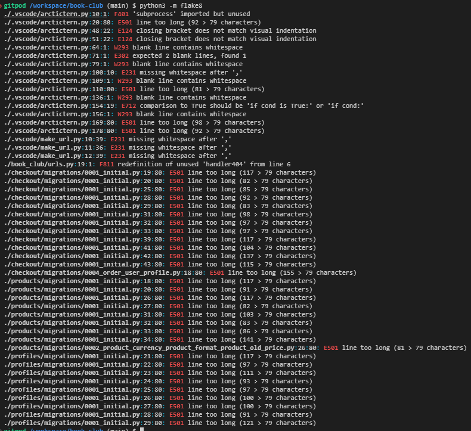

# Coder's Cafe 
This is a fullstack project written in Python using the Django framework on the backend, connecting to a PostgreSQL database. Using the bootstrap framework on the frontend within HTML and CSS

## Important notes 
The admin superuser is as follows, username: `admin123` & password is: `a3e5n7`.

In order to test the functions of the checkout page and all its features, new users can be created in the account page.

## Testing
Initally I tested to ensure that the homepage would be responsive over desktop, tablet and mobile screens
Responsive home screen on mobile:

Homepage:

Responsive homescreen on tablet: 

And on a phone:

This responsiveness is also true for other pages including the products, basket, and checkout. Noting that stripe is successfully integrated into this test environment to take card payments and give us a success or error message.

And on success, we get a notification, order details and a success email gets sent to our email address.

This is the booking screen from the staff member's perspective:

They are also able to create an account and log in and out of it.

Logging in as a superuser (admin123, see above) we are easily able to add new products under My Acount -> Product Management

They are also able to edit and delete products by navigating to the product page (or even from the all products page)

Navigating these successfully works at creating/editing/deleting the chosen product.

## Bugs 

There was an issue with very slow loading speeds for the products, this is due to the large number of available products on this site. I tackled this by using Django pagination to separate the products onto pages.
Webhooks were receiving a 401 error, the cause was that the link was not public, so I made the URL public to resolve this.

### Python Validator

The code passes the inbuild python flake validator. The only errors are auto-generated classes and a single one in urls.py about the 404 handler, but this is the standard implementation set out by code institute's documentation.

## Deployment 

This project was deployed onto Heroku, the link for which is: https://nicole-mann-book-club-a8cddb487546.herokuapp.com/

## Credits 

- Code institute course materials
- Django documentation: https://docs.djangoproject.com/en/5.0/
- Font Awesome for icons
- Favicon created from https://favicon.io/favicon-converter/
- Image on main site page from Pexels

## Struggles

This was a very challenging project, as it combined a range of new techniques that were unfamiliar to me, I made a number of minor errors throughout that impacted the output and produced error messages

